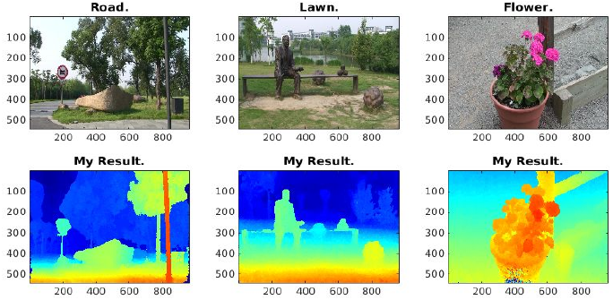

# EE5731R-CDMR
Course project for Visual Computing course [EE5731R](http://php-robbytan.rhcloud.com/teaching/2015_nus_visual/index.html).

## Motivation
-------

Write a program in matlab to estimate depth map from video using this method: [Depth Map from Video Sequence](http://www.cad.zju.edu.cn/home/bao/pub/Consistent_Depth_Maps_Recovery_from_a_Video_Sequence.pdf).

To make it simple, I only reimplemented:
- Disparity Initialization for video.
- Bundle Optimization for video.

> *Contain some minor changes.*

### Brief Guide
-------

[0] Place The unzipped Video Dataset(s) at `./video/{$DATASETNAME}/src/{$IMAGENAME}.jpg`
- `$DATASETNAME = Road`, url: http://www.cad.zju.edu.cn/home/gfzhang/projects/videodepth/data/Road.zip
- `$DATASETNAME = Lawn`, url: http://www.cad.zju.edu.cn/home/gfzhang/projects/videodepth/data/Lawn.rar
- `$DATASETNAME = Flower`, url: http://www.cad.zju.edu.cn/home/gfzhang/projects/videodepth/data/Flower.rar

[1] Compile GCMex by `./toolbox/GCMex/GCMex_compile.m` if necessary.

[2] RUN './demo_disparsity_initialization.m' FOR VIDEO SEQUENCE DISPARSITY INITIALIZATION.
- Outpus: `./result/init/{$DATASETNAME}/test{$ID}.mat`  # Orginal Outputs
- Outpus: `./result/init/{$DATASETNAME}/test{$ID}.png`  # Rendered Maps

[3] RUN ./demo_bundle_optimization.m FOR VIDEO SEQUENCE BUNDLE OPTIMIZATION.
- Outpus: `./result/bundle_p{$pass_id}/{$DATASETNAME}/test{$ID}.mat`  # Orginal Outputs
- Outpus: `./result/bundle_p{$pass_id}/{$DATASETNAME}/test{$ID}.png`  # Rendered Maps
    
> IMPORTANT: 
>  Depend on your computer's permorfance, It may cost 30~60 mins for processing 1 frame with 20 neighborhoods.
>  You can (but not recommend) cut the neighborhood frame number for acceleration (~5mins/frame). 

### Tested On
-------

MATLAB 2014B x64:
- With Parallel Computing Toolbox.

UBUNTU 14.04 LTS x64
- Intel i7-5820k, 3.3GHz
- Memory DDR4 2133MHz 64gb (16GBx4)

### Noted:
-------

All three datasets have been processed by a distributed computing cluster.
(12 computers, 72 cpu cores intotal)

The results are saved under [result](result).

It costed:
- ~20 hours to do the disparity initialization
- ~20 hours to do the first pass of the bundle optimization (i just did one pass)

> Sorry for didn't optimize the speed.
> Please make sure your computer is powerful enough and yourself is patient enough to run this code.

### Reference:
-------

Zhang, Guofeng, et al. "Consistent depth maps recovery from a video sequence." Pattern Analysis and Machine Intelligence, IEEE Transactions on 31.6 (2009): 974-988.

